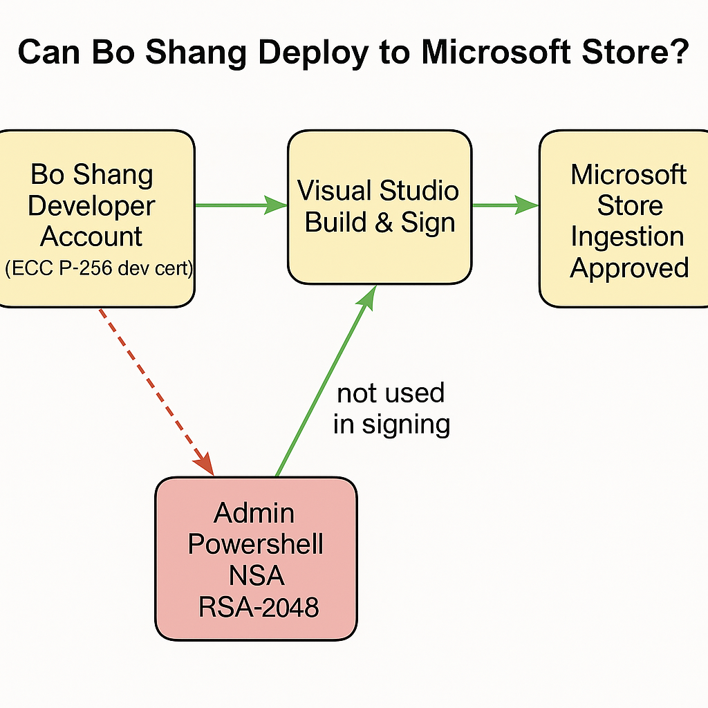
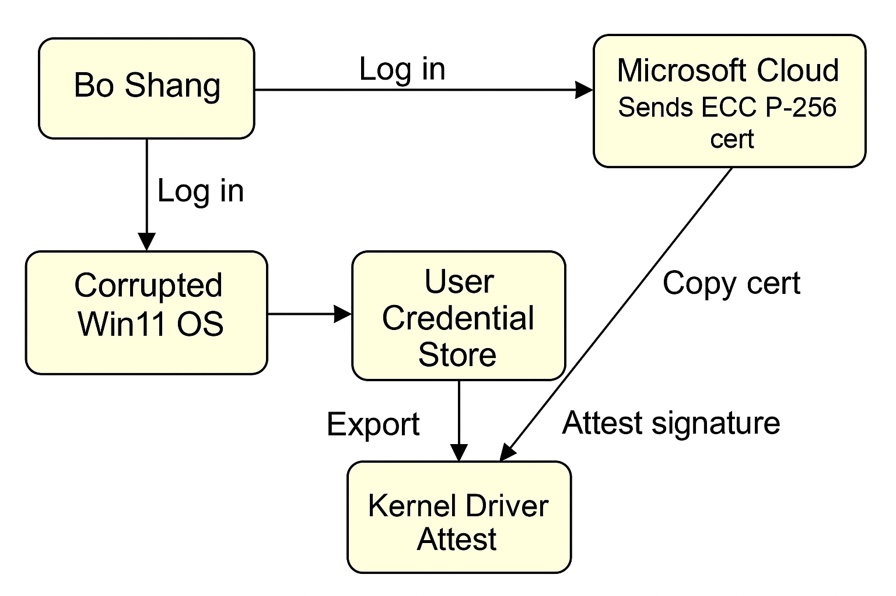

# Bo making new Microsoft acct to attest win 11 pro

The graph shows Bo Shang’s full thought-process flow:

Attest & save a pristine ECC P-256 cert from Microsoft Cloud.

Launch Ghidra, load kernel drivers, and extract their embedded signatures.

Feed both the trusted ECC cert and the corrupted TPM RSA-2048 cert into a comparison step.

A decision node flags a mismatch (integrity compromised → reinstall) or confirms the drivers are clean.
# Leaking TPM (i guess) classified stolen cert algorithm

RSA 2048

// Flow: NSA intercept → corrupted vendor leaf cert → global TPM login hijack
digraph G {
    rankdir=LR;
    node [shape=box, style=filled, fillcolor="#FFFFCC"];

    Bo       [label="Bo Shang\nECC P-256 cert"];
    Cloud    [label="Microsoft Cloud"];
    NSA1     [label="NSA Intercept"];
    NSAroot  [label="NSA Root Key\nRSA-2048"];
    Vendor   [label="Vendor Firmware\nService"];
    TPM      [label="TPM Chip\nCorrupted Leaf\nRSA-2048"];
    Login    [label="Win11 Login\nToken Signed"];

    Bo    -> Cloud  [label="Sign-in",                color=darkgreen];
    Cloud -> NSA1   [label="Fetch user cert",        color=red];
    NSA1  -> NSAroot[label="Store/Decrypt",          color=red];
    NSAroot -> Vendor [label="Issue corrupted\nvendor leaf cert", color=red];
    Vendor -> TPM   [label="Firmware push",          color=red];
    TPM   -> Login  [label="Signs token", style=dashed, color=gray];
    Login -> Bo     [label="Authenticated",          color=darkgreen];
}

